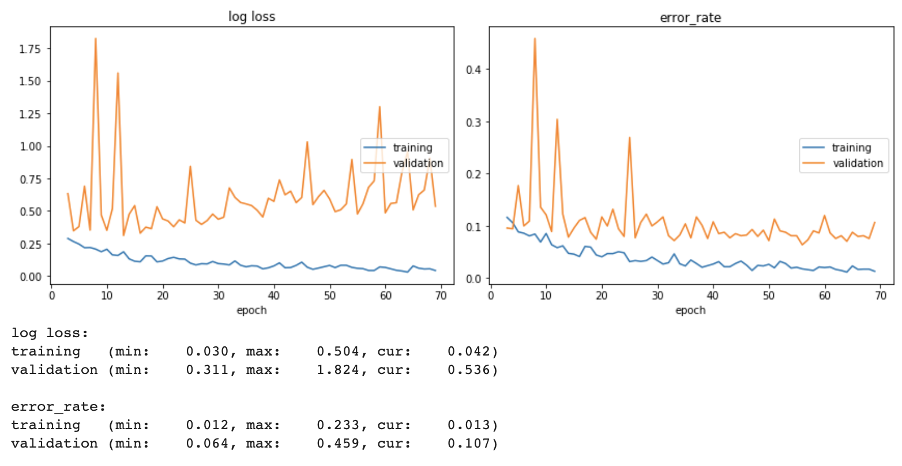
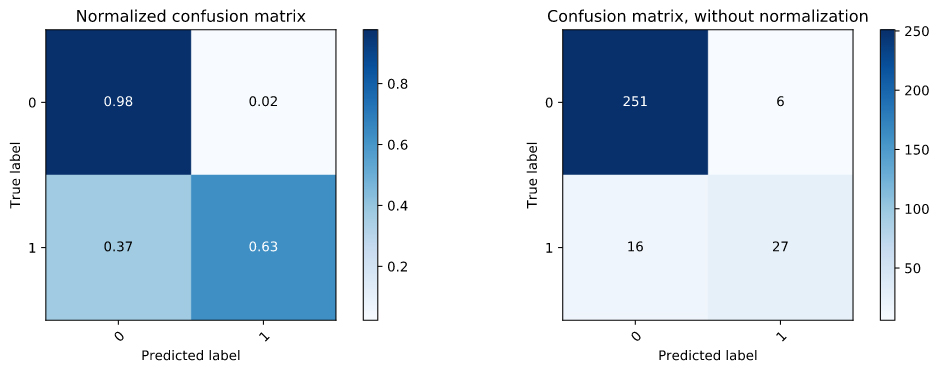
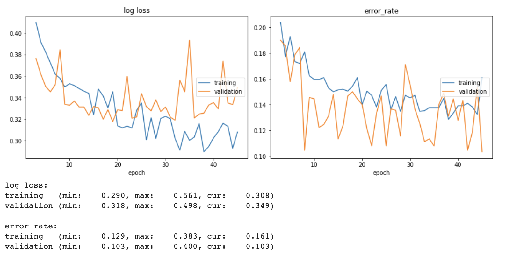
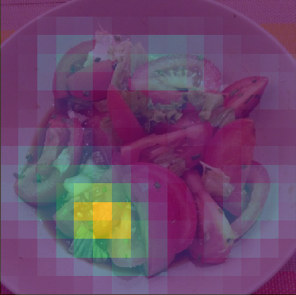

# Home assignment answer - Tomatoes Allergies
---
<a href="https://www.python.org/"></a>
<a href="https://github.com/psf/black"></a>

---
You will find in this repository code of the [FoodVisor Home Assigment](https://github.com/Foodvisor/home-assignment).

Architecture of folder/file:
```
.
└── home-assigment-answer
```
# Assignement #1
## Prerequisites
To build this classifier I used PyTorch. I trained the model on using Google Colab. To install required packages:
```
pip install -r requirements.txt
```
## Run Training
To train the model use:
```
python train.py folder_imgs img_annotations label_mapping model_filepath config
```

With:
- `folder_imgs`: path folder with image dataset
- `img_annotations`: path file for `the annotations.json`
- `label_mapping`: path file for the `label_mapping.csv`
- `model_filepath`: path file to save the model checkpoint
- `config`: path file for the `config.json` file. 
Default `config.json`:
```json
{
    "param_loader": {
        "batch_size": 32,
        "validation_split": 0.2,
        "shuffle_dataset": true,
        "random_seed": 42
    },
    "param_classifier": {
        "threshold": 0.5,
        "learning_rate": 0.001,
        "epochs": 40,
        "loss_weight": [1, 6]
    },
    "param_common": {
        "split_size_train_test": [0.65, 0.25, 0.1],
        "regex_aliment": "[Tt]omate(s)?",
        "save_checkpoint_each": [20, 40]
    }
}
```

## Run Prediction
To predict class from an image use:
```
python pred.py model_filepath img_filepath
```
With:
- `model_filepath`: filepath for the model checkpoint
- `img_filepath`: filepath for the image we want to predict class


## Classifation and Results
I will briefly explain here what've done so far and the results I've got.

### Problematic
The goal of the assignment is to build a classifier in order to 
know if a picture (of a meal) contains tomatoes. Here by "contains 
tomatoes" we mean "fresh tomatoes". Thus, we'll not detect Ketchup for example.

### Approach
The given dataset is composed of 3000 images, each image has an associated dictionnary 
containing bounding box of aliment present in the meal.
Here, two options comes-up:
1. build a binary classification for each image
2. use the bouding box and an object detector to detect tomatoes

I will follow the first way as it should give almost the same results and is less 
complicated to build.

### Classifier
Several options are available here to build a classifier:
1. build image classifier from scratch using CNN for example
2. use well know classifier architecture from scratch (ResNet, Alexnet, VGG, Inception etc..)
3. use transfer learning with pretrained architecture (same ones)

Considering the number of sample we have, it is more interesting to use transfer learning
to use the pretrained feature extractor and avoid a bit of overfitting. As we do not have a big dataset and our data is not 
similar to ImageNet (the dataset used to train ResNet), we'll freeze the only some lower layer. I choose to freeze the first 6
layer (this number is choosen quite randomly) and change the last layer to match out 2 ouput class.

PyTorch offer a lot of pretrained model in `torchvision.models`, I will use here ResNet18 ([Deep Residual Learning for Image Recognition](https://arxiv.org/abs/1512.03385)).
This model is very lighteweight compared to ResNet50 or 102, it is good choice to get first results and it will probably less overfit than more complex
network.


Workflow to train the classifier:
- Build dataset using `FoodVisorDataset`
- Build loader using pytorch `DatasetLoader`, we use a sampler for the loader:
- Build model classifier with `AlimentClassifier().build_model()`
- Train model with `AlimentClassifier().train_classifier(train_loader, test_loader)`

### Results

Here are the plot of training and test error_rate:



We can see we start to overfit a bit around around 30 epochs. However, the error rate seems to decrease even after 30 epochs. So I'll save the model at 
50 epochs. The model give an error rate around __*0.05*__.
To test the model on unseen example, I took 10% of the dataset before training. The ouput of those 10% gives the following confusion matrix:




Here is a brief sum up of what I used for the classifier:  

| Model| Optimizer | Loss Function | Epochs| Batch Size | Learning Rate|
|--|--| --|-- |--|--|
| ResNet18 with 6 bottom layers freezed| Adam | Weighted Cross Entropy Loss | 80 | 32 | 0.001 |

### Model Release
ResNet18 with 6 first layers freezed, trained on 1950 images : [home-assignment-answer/releases/tag/v.0.3](https://github.com/yohann84L/home-assignment-answer/releases/tag/v.0.3)

### What could be improved

- better data augmentation to limit overfitting
- data augmentation using Generative Adversarial Networks (by creating synthetic sample)
- try with other model, like ResNet50
- ...

## Work In Progress
Currently trying with EfficientNet from the implementation of @lukemelas [EfficientNet-PyTorch](https://github.com/lukemelas/EfficientNet-PyTorch). I'm working on this feature on the branch [feature/EfficientNet_implementation](https://github.com/yohann84L/home-assignment-answer/tree/feature/EfficientNet_implementation).

Here is the loss/error_rate with EfficientNet-B0:



# Assignement #2
The class activation module seems to work, however I did not test it using bounding box to get a score on it.
Code to use it:
```python
import albumentations as A
from src.class_activation_mapping import ClassActivationMapping
from albumentations.pytorch import ToTensorV2
from src.classifier import load_checkpoint

tranformation_pipeline_test = A.Compose(
    [
        A.Resize(width=224, height=224, always_apply=True),
        A.Normalize(
            mean=[0.485, 0.456, 0.406],
            std=[0.229, 0.224, 0.225]),
        ToTensorV2()  # convert the image to PyTorch tensor
    ],
    p=1,
)

model = load_checkpoint("models/ResNet18_checkpoint_e50.pth", device="cpu")

cam = ClassActivationMapping(model, "image_to_predict/4db849ecafb0fbac1f3b802d75a960d0.jpeg", tranformation_pipeline_test)
cam_map = cam.get_cam()
cam.show_cam_on_image(cam_map)
```

And here are the result:



## References
- [FoodVisor Home Assigment](https://github.com/Foodvisor/home-assignment)
- [Custom Datasets/Dataloaders in PyTorch](https://pytorch.org/tutorials/beginner/data_loading_tutorial.html#writing-custom-datasets-dataloaders-and-transforms)
- [Example custom dataset](https://github.com/utkuozbulak/pytorch-custom-dataset-examples#custom-dataset-fundamentals)
- [Example PyTorch Image Classification](https://github.com/LeanManager/PyTorch_Image_Classifier)
- [Albumentations library](https://github.com/albumentations-team/albumentations)
- [Livelossplot librairie](https://github.com/stared/livelossplot)
- [Save and loading checkpoint function from](https://github.com/LeanManager/PyTorch_Image_Classifier/blob/master/Image_Classifier_Project.ipynb)
- [Use of hooks](https://blog.paperspace.com/pytorch-hooks-gradient-clipping-debugging/)
- [Learning Deep Features for Discriminative Localization](https://arxiv.org/abs/1512.04150)